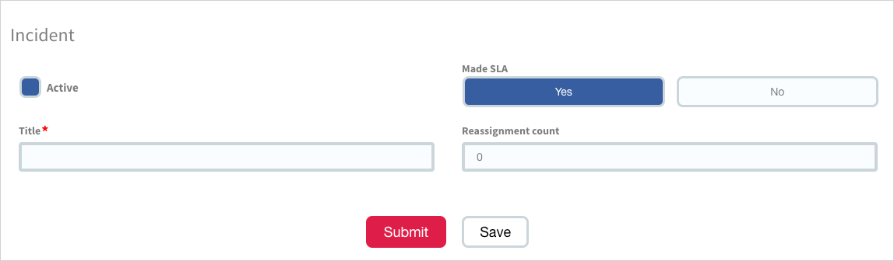

# Form Decoration

This application is designed to easily allow you to style, and add custom functionality to form fields, whilst retaining the power of the out-of-box form widget.



**NOTE:** this repository contains documentation only. The repo containing the applicaton can be found at [platform-experience/form-decoration-app](https://github.com/platform-experience/form-decoration-app).

## Why?

The out-of-box form widget in Service Portal is extremely powerful, in that it leverages base-platform functionality so that forms can be designed by configuration rather than code. Some examples of this functionality are form views, UI Policies, and Client Scripts.

While it's very powerful, it has it's limitations as well. Specifically, there is no out-of-box way to style elements, or to add special functionality (e.g. Google address lookup) to fields/variables on the form. This means that while a portal can look good, it's appearance is often brought down by the inclusion of the form widget on the page which doesn't conform to the styling of the portal.

Prior to this application, the only way to create your own custom field types and styling was to create your own form within a widget, sacrificing all the base-platform functionality.

## Installation

To use this application, simply navigate to `System Applications` > `Studio` on your instance. In the dialog that opens, select `Import From Source Control` and point it at the following repository:

```
https://github.com/platform-experience/form-decoration-app.git
```
**NOTE:** Executing **Apply Remote Changes** from the **Source Control** menu of ServiceNow Studio will uninstall and reinstall the application, dropping all the tables and thus wiping your configuration data, thus it is suggested not to do this. It is aimed for this application to be published to the ServiceNow Store eventually, which will allow you to receive updates to the app without wiping your data.
## Getting Started
There is a single widget included in this application called **Decorated Form** (`pe-decorated-form`). This widget must be used for the form decoration functionality to work. For instructions on how to add it to a Service Portal page, refer to the [ServiceNow Documentation website](https://docs.servicenow.com/bundle/helsinki-servicenow-platform/page/build/service-portal/task/t_AddWidgetsToAPage.html).

This widget works similar to the out-of-box form widget, and can be controlled with the following options/parameters:

| Option (Label)  | Option (Name)  | URL Parameter | Description | Mandatory | Default |
| ------------- | ------------- | ------------- | ------------- | ------------- | ------------- |
| Table  | `table` | `table` | The table to show | Yes |
| Sys ID  | `sys_id` | `sys_id` | The Sys ID of the record in the table  | No | `-1` |
| View  | `view` | `view` | The view to use | No | `service_portal` |
| Show only primary action  | `primary_only` |  | Whether to only show the primary UI action | No | `false` |

In cases above where a URL parameter can be supplied, supplying an option will override a URL parameter if supplied.

The application comes with a Service Portal Page called `df_test` with the widget already on it. If you open the below URL on your instance you can see it in action.

```
/sp?id=df_test&table=incident
```

## Creating a custom field type
To create your own field type, simply create a new record in the **Directive** table (`x_snc_formDec_directive`).

| Field  | Description |
| ------------- | ------------- |
| Name (camel-case)  | The name of the directive in camel-case.  |
| Screenshot  | An example screenshot of the directive.  |
| Description  | A description of the directive, explaining functionality and anything that can't be conveyed in the screenshot.  |
| Template  | HTML template of the field |
| Link function  | Link function of the field |
| Controller function  | Angular controller of the field |
| CSS  | CSS to style the field (not SASS compatible) |

**NOTE:** 

- There are an additional two fields on the table which are read only: `spinal_case` and `snake_case`. These fields will be auto-populated based on the value entered in the **Name (camel-case)** field.
- CSS will be parsed and scoped so it won't conflict with other fields, and the result of this parsing will be stored in the **CSS (parsed)** field (`css_parsed`).

When creating your directive, you need to ensure it interacts with the form correctly so that when the form is submitted, the correct value gets sent to the server.

- The value of your field should in most cases be bound to the `field.stagedValue` scope variable.
- - When the user focuses on the field, you should emit the Angular event `sp.spFormField.focus`.
- When the user is no longer interacting with the field, you should emit the Angular event `sp.spFormField.blur` and pass the stagedValue into the FieldValue scope function (e.g. `$scope.fieldValue($scope.field.stagedValue);`

**NOTE:**  be careful when using [one-time bindings](https://toddmotto.com/angular-one-time-binding-syntax/), as if the field/form changes as a result of UI Policy/Client Script you want these updates to reflect on your field.

## Associating a field type with a field/variable
You must define a relationship between the directive you created and the form field/variable. Doing this will mean that when the field/variable is shown on the form, the directive will be used to display it instead of the out-of-box way of representing it.

If a field does not have this association, the out-of-box method of representing the field will be used.

You can define the relationship using the **Decorators** table (`x_snc_formdec_decorator`).

| Field  | Description |
| ------------- | ------------- |
| Directive  | A reference to the directive record created in step 2. |
| Portal  | The portal where this relationship should apply. |
| Field  | The field for which the directive should be used. |
| Variable  | The variable for which the directive should be used. |

You can link a single **Decorator** record to both a field AND variable if desired.
## Security
The application has 4 roles which can be granted to users to allow them to configure the application.

| Role  | Description | Contains roles |
| ------------- | ------------- | ------------- |
| `x_snc_formDec.admin`  | Administrative access | `x_snc_formDec.developer` `x_snc_formDec.manager ` |
| `x_snc_formDec.developer`  | Can manage directive records | `x_snc_formDec.user` |
| `x_snc_formDec.manager`  | Can manage decorator records | `x_snc_formDec.user` |
| `x_snc_formDec.user`  |  | |

No roles are required to be able to view the form widget or the custom fields.

## Configuration

- [Styling](blob/master/README.md)

## Example Directives
Below you can see some examples from the fields that come with the application if you install demo data.

- [fdExampleStringField](blob/master/examples/fdExampleStringField)

## Get assistance

For assistance or feature requests, please raise an issue within this GitHub repo (`platform-experience/form-decoration`). Best efforts will be made to resolve these.